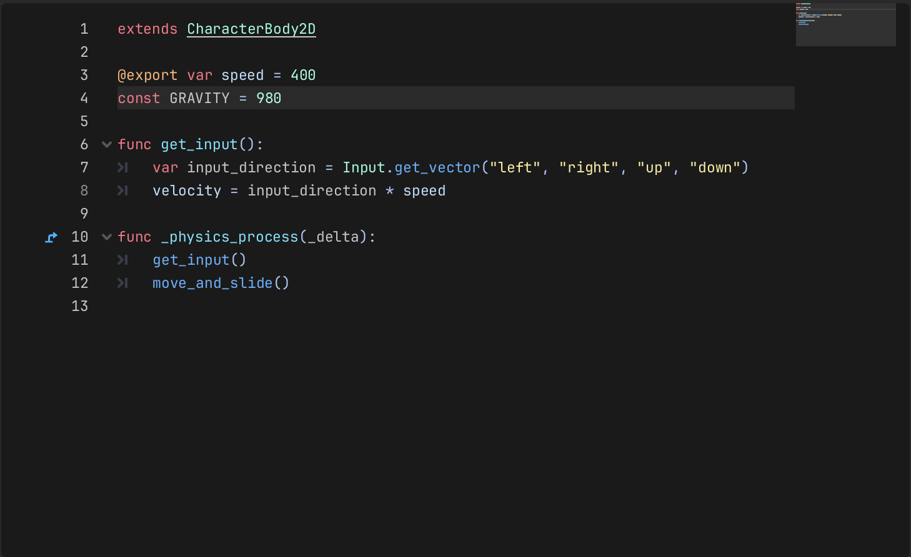
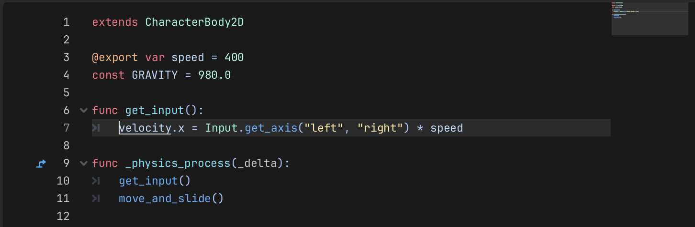
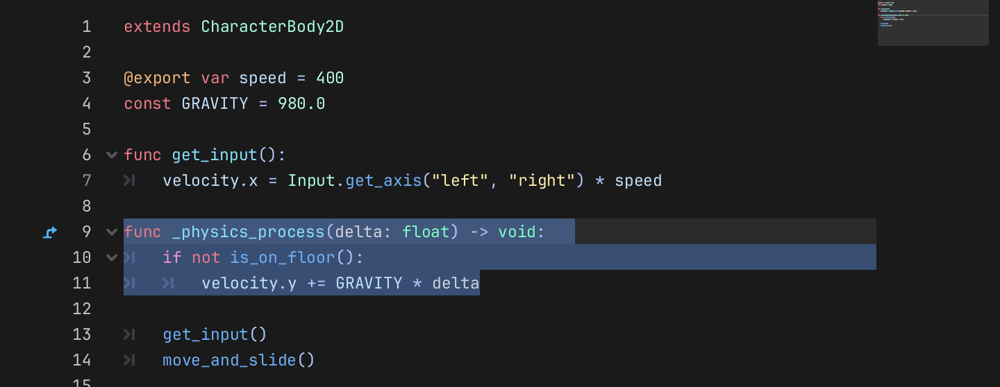
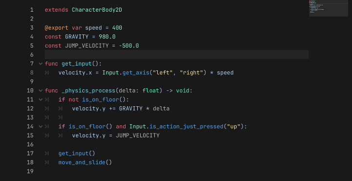

# Aktiver fysik (Enable Physics)

> Tip: Du kan indstille tilesets til at fylde mindre i fysik-verdenen!

---

### Del 1: Tilføj fysik til tilemap

Først skal vi tilføje fysik til vores tilemap, så spilleren kan kollidere med verdenen og ikke bare falde igennem gulvet.

---

### Del 2: Giv spilleren tyngdekraft og hop

**1.**
Tilføj tyngdekraft (gravity) til din `spiller.tscn`.
Tyngdekraft er det, der trækker os ned mod jorden – ligesom i virkeligheden!

Læg mærke til: Selv om du tilføjer tyngdekraft nu, falder spilleren ikke endnu. Det fikser vi i næste trin!

---

**2.**
Opdater bevægelseskoden, så den kun bruger `left` og `right`.

Nu kan spilleren kun gå frem og tilbage. `up` gemmer vi til at hoppe – det kommer snart!

---

**3.**
Tilføj nu denne kode. Vi bruger `GRAVITY * delta` til at få spilleren til at falde.

**Hvad er delta?**
Computere opdaterer spillet mange gange i sekundet. `delta` er den lille tid, der går mellem hver opdatering. Ved at gange med `delta` falder spilleren med samme hastighed, uanset om computeren er hurtig eller langsom.

Vi tilføjer også `if not is_on_floor()` – det er en indbygget funktion, der tjekker, om spilleren rører gulvet. Spilleren falder kun, når hun ikke står på noget!

> OBS: Hvis du har skrevet `_delta` med en understregning foran, skal du fjerne understregningen nu.

---

**4.**
Nu tilføjer vi hop! Øverst sætter vi `const JUMP_VELOCITY = -500`.

**Hvorfor minus?**
I Godot peger y-aksen nedad – det betyder, at jo større tallet er, jo længere nede er man. For at hoppe op skal vi derfor bevæge os i den modsatte retning, altså med et negativt tal. `-500` skyder spilleren hurtigt op i luften!

Nede i `_physics_process` tjekker vi, om spilleren `is_on_floor()` (står på en tile) og trykker `up`. Hvis begge dele er sande, sætter vi `velocity.y = JUMP_VELOCITY` – og spilleren hopper!

---

**Har du tid til mere? Prøv disse udfordringer!**

**Leg med tallene:**
Prøv at ændre tallene for `GRAVITY`, `JUMP_VELOCITY` eller `speed` øverst i din kode. Hvad sker der, hvis du gør tyngdekraften meget lille? Kan du lave måne-fysik? Hvad hvis du hopper utrolig højt?

**Byg dit level:**
Åbn dit tilemap og byg videre på dit level! Tilføj flere platforme, lav en hemmelig passage, eller gør banen længere. Det er dit spil – giv det dit eget præg!

**Tilføj en kasse:**
Download grafikken fra Grafik-sektionen nedenfor. Tilføj en `RigidBody2D` til din scene, og sæt grafikken på den. En `RigidBody2D` har allerede fysik indbygget – den falder ned og kolliderer med dine tiles helt af sig selv, uden at du skal skrive kode!
